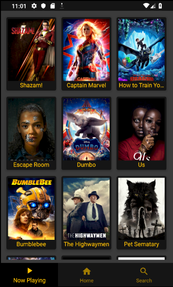
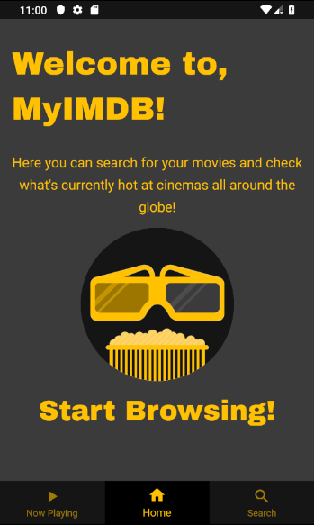
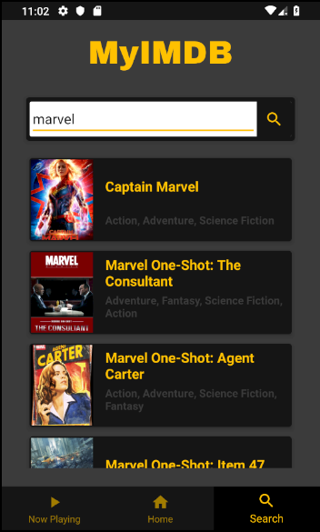
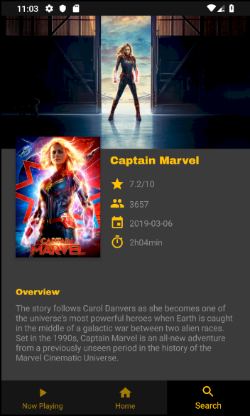

# MyIMDB-v1

The first version of a movie app, that allows an user to check which movies are currently being displayed around cinemas and theaters around the world, search for specific movies and check their details making use of the free TMDB API.

Minor bug-fixes required, altough main functionatilies of the app are still present and functioning.

 
 
 

